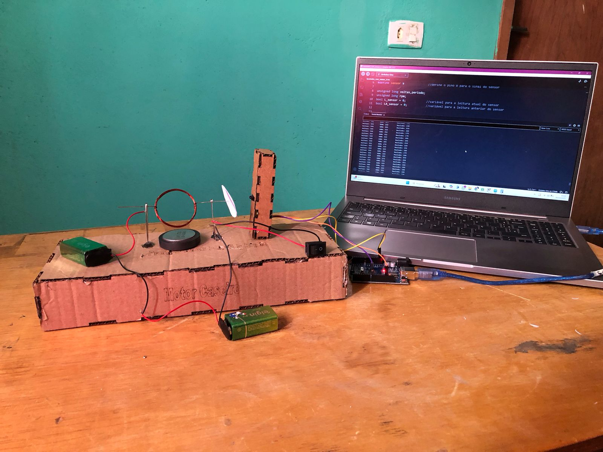
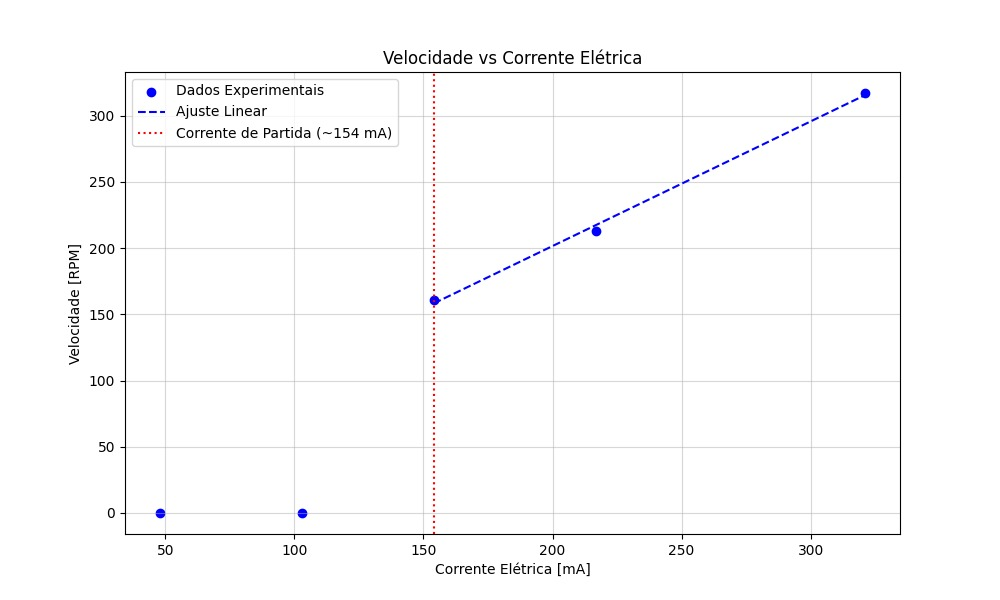
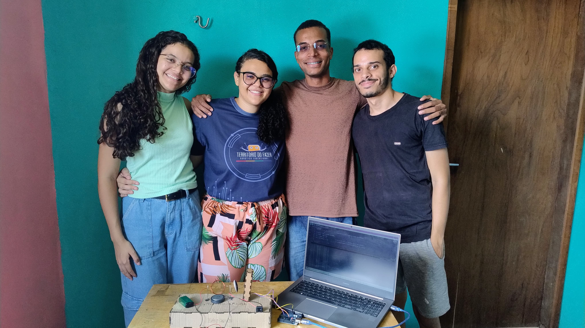

#  ⚡ Experimento: Motor de corrente coontínua CC

> Este projeto foi desenvolvido como parte de um experimento de Física Geral na **Universidade Federal Rural de Pernambuco (UFRPE)**. O objetivo foi construir um motor CC caseiro utilizando materiais de fácil acesso e analisar o comportamento da velocidade de rotação em função da corrente elétrica aplicada.



## Ferramentas utilizadas

<div align="left">
  
  
  
</div>

## Análise dos Dados

O código desenvolvido em Python permite analisar os dados experimentais obtidos durante o funcionamento do motor. A velocidade de rotação (em RPM) foi medida utilizando um disco de papel acoplado ao eixo do motor e um sensor infravermelho. A partir desses dados, foi possível plotar gráficos e realizar ajustes para entender a relação entre a corrente elétrica e a velocidade do motor.

### Gráfico: Velocidade vs Corrente Elétrica

O gráfico abaixo mostra a relação entre a corrente elétrica (em mA) e a velocidade de rotação do motor (em RPM). Observou-se que o motor só começa a girar a partir de uma corrente mínima de **154 mA**, indicando que abaixo desse valor a força eletromotriz gerada não é suficiente para vencer o atrito estático.



> Coeficiente angular (inclinação): 0.9407133148990025 RPM/mA

> Margem de erro (desvio padrão dos resíduos): ±3.20 RPM

### Código de Análise

O código utiliza a biblioteca `matplotlib` para plotar os gráficos e a função `np.polyfit` para ajustar uma reta aos dados experimentais na região onde o motor está em funcionamento. Abaixo está um trecho do código responsável pelo ajuste linear:

```python
# Ajuste linear para a região onde o motor está funcionando
coef = np.polyfit(current_working, speed_working, 1)  # Ajuste linear
poly = np.poly1d(coef)
x_fit = np.linspace(min(current_working), max(current), 100)
plt.plot(x_fit, poly(x_fit), '--', color='red', label='Ajuste Linear')
```

## Observações

- **Torque e Massa:** Embora o código inclua cálculos de torque, massa e peso, essas funcionalidades não foram utilizadas neste experimento devido à falta de uma estrutura adequada para medição do torque. No entanto, o código está preparado para implementações futuras.
- **Dados Experimentais:** Os dados utilizados foram coletados experimentalmente, variando a tensão no circuito e medindo a velocidade de rotação correspondente.

## Integrantes do Grupo

   

- Alysson Victor Silva de Carvalho - Engenharia de Controle e Automação
- Elâne da Silva Ferreira - Engenharia de Controle e Automação
- Maria Eduarda Rodrigues do Nascimento - Engenharia de Controle e Automação
- Yann Keven Jordão Leão - Engenharia da Computação
